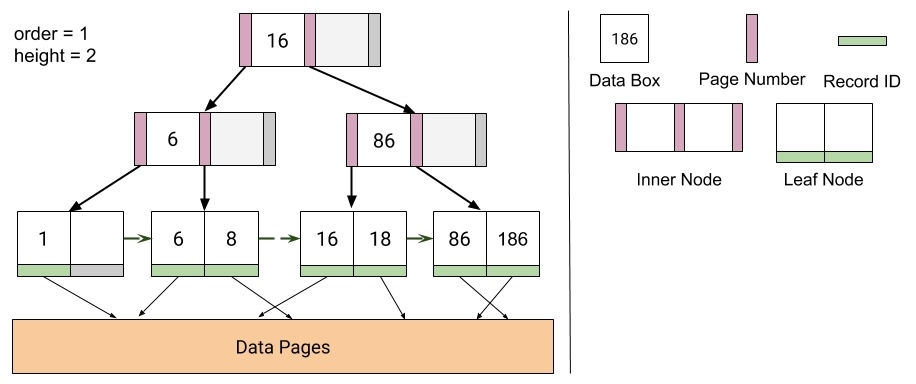
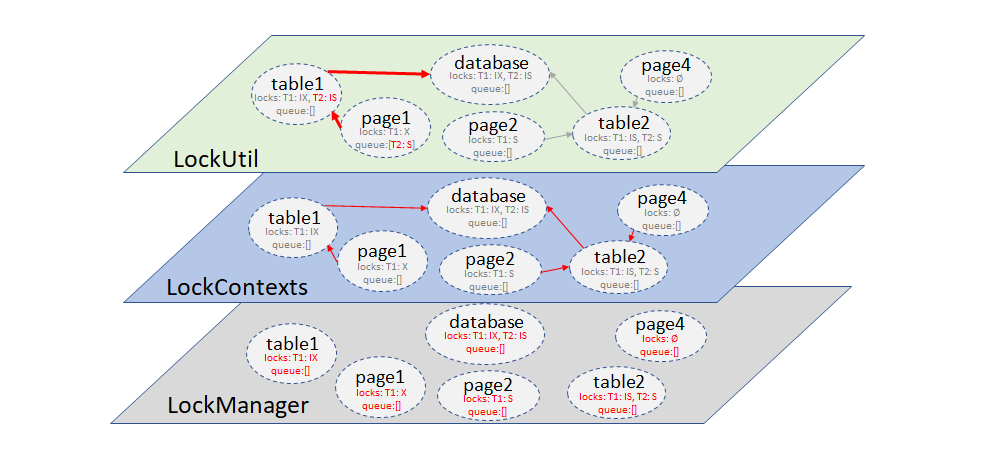

# Database Management System

This repo contains a bare-bones database implementation, which supports
executing simple transactions in series. It contains support for
B+ tree indices, efficient join algorithms, query optimization, multigranularity
locking to support concurrent execution of transactions, and database recovery.

## Overview

This database management system project contains four major topics:

### [B+ tree indices](/src/main/java/edu/berkeley/cs186/database/index)
In this project, I implemented B+ tree indices.

___

### [Joins and Query Optimization](/src/main/java/edu/berkeley/cs186/database/query)
In this project, I implemented some join algorithms: block nested loop join, sort merge, and grace hash join. Also, a piece of a relational query optimizer: Plan space search.

___

### [Concurrency](/src/main/java/edu/berkeley/cs186/database/concurrency)
In this project, I implemented the bottom layer (`LockManager`) and lock types, the middle and top layer (`LockContext` and `LockUtil`) of multigranuarlarity locking.

___

### [Recovery](/src/main/java/edu/berkeley/cs186/database/recovery)
In this project, I implemented write-ahead logging and support for savepoints, rollbacks, and ACID compliant restart recovery.

## Configuration and files explanation
Look at [here](configuration.md) for configuration and files explanation.
