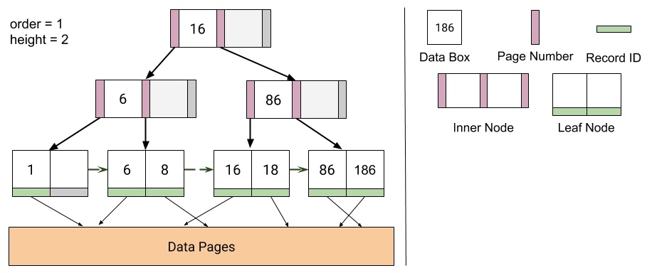

# B+ tree indices
<p align="center">


In this project, I implemented B+ tree indices.

## Project Structure Diagram
<p align="center">


- Green Boxes: functions that I implemented
- White boxes: next to each function, contains a quick summary of the important points that you need to consider for that function.
- Orange boxes: hints for each function which may point to helper functions.

## My Tasks
### 1. LeafNode::fromBytes

I first implemented the [`fromBytes`](https://github.com/JC01111/Database-Management-System/blob/a45f039458ed48bcb2789133d5e9657fecfb589d/src/main/java/edu/berkeley/cs186/database/index/LeafNode.java#L445) in `LeafNode`. This method reads a `LeafNode` from a page. For information on how a leaf node is serialized, see `LeafNode::toBytes`. For an example on how to read a node from disk, see `InnerNode::fromBytes`. Your code should be similar to the inner node version but should account for the differences between how inner nodes and leaf nodes are serialized.

Once you have implemented `fromBytes` you should be passing `TestLeafNode::testToAndFromBytes`.

### 2. get, getLeftmostLeaf, put, remove

After implementing `fromBytes`, I implemented the following methods in `LeafNode`, `InnerNode`, and `BPlusTree`:

* `get` in [`InnerNode`]((https://github.com/JC01111/Database-Management-System/blob/a45f039458ed48bcb2789133d5e9657fecfb589d/src/main/java/edu/berkeley/cs186/database/index/InnerNode.java#L82)) and [`BPlusTree`](https://github.com/JC01111/Database-Management-System/blob/a45f039458ed48bcb2789133d5e9657fecfb589d/src/main/java/edu/berkeley/cs186/database/index/BPlusTree.java#L143).
* `getLeftmostLeaf` in [`LeafNode`](https://github.com/JC01111/Database-Management-System/blob/a45f039458ed48bcb2789133d5e9657fecfb589d/src/main/java/edu/berkeley/cs186/database/index/LeafNode.java#L155) and [`InnerNode`]((https://github.com/JC01111/Database-Management-System/blob/a45f039458ed48bcb2789133d5e9657fecfb589d/src/main/java/edu/berkeley/cs186/database/index/InnerNode.java#L91)).
* `put` in [`LeafNode`]((https://github.com/JC01111/Database-Management-System/blob/a45f039458ed48bcb2789133d5e9657fecfb589d/src/main/java/edu/berkeley/cs186/database/index/LeafNode.java#L162)), [`InnerNode`]((https://github.com/JC01111/Database-Management-System/blob/a45f039458ed48bcb2789133d5e9657fecfb589d/src/main/java/edu/berkeley/cs186/database/index/InnerNode.java#L100)), and [`BPlusTree`]((https://github.com/JC01111/Database-Management-System/blob/a45f039458ed48bcb2789133d5e9657fecfb589d/src/main/java/edu/berkeley/cs186/database/index/BPlusTree.java#L261)).
* `remove` in [`LeafNode`]((https://github.com/JC01111/Database-Management-System/blob/a45f039458ed48bcb2789133d5e9657fecfb589d/src/main/java/edu/berkeley/cs186/database/index/LeafNode.java#L245)), [`InnerNode`]((https://github.com/JC01111/Database-Management-System/blob/a45f039458ed48bcb2789133d5e9657fecfb589d/src/main/java/edu/berkeley/cs186/database/index/InnerNode.java#L180)), and [`BPlusTree`]((https://github.com/JC01111/Database-Management-System/blob/a45f039458ed48bcb2789133d5e9657fecfb589d/src/main/java/edu/berkeley/cs186/database/index/BPlusTree.java#L344)).

Each of these methods, although split into three different classes, can be viewed as one recursive action each - the `BPlusTree` method starts the call, the `InnerNode` method is the recursive case, and the `LeafNode` method is the base case. It's suggested that you work on one method at a time (over all three classes).

There is a provided `sync()` method in `LeafNode` and `InnerNode`. The purpose of `sync()` is to ensure that representation of a node in our buffers is up-to-date with the representation of the node in program memory. **Remember to call `sync()` when implementing the two mutating methods** (`put` and `remove`).

### 3. Scans

I implemented the following methods in `BPlusTree`:

* [`scanAll`](https://github.com/JC01111/Database-Management-System/blob/a45f039458ed48bcb2789133d5e9657fecfb589d/src/main/java/edu/berkeley/cs186/database/index/BPlusTree.java#L200)
* [`scanGreaterEqual`](https://github.com/JC01111/Database-Management-System/blob/a45f039458ed48bcb2789133d5e9657fecfb589d/src/main/java/edu/berkeley/cs186/database/index/BPlusTree.java#L237)

In order to implement these, I also completed the [`BPlusTreeIterator`](https://github.com/berkeley-cs186/sp24-rookiedb/blob/master/src/main/java/edu/berkeley/cs186/database/index/BPlusTree.java#L422) inner class in `BPlusTree.java`to complete these two methods.

After completing this Task you should be passing `TestBPlusTree::testRandomPuts`.

This implementation **does not** have to account for the tree being modified during a scan. For the time being you can think of this as there being a lock that prevents scanning and mutation from overlapping, and that the behavior of iterators created before a modification is undefined (you can handle any problems with these iterators however you like, or not at all).

### 4. Bulk Load

Much like the methods from the Task 2 I implemented `bulkLoad` within all three of `LeafNode`, `InnerNode`, and `BPlusTree`. Since bulk loading is a mutating operation you will need to call `sync()`. Be sure to read the instructions in [`BPluNode::bulkLoad`](https://github.com/berkeley-cs186/sp24-rookiedb/blob/master/src/main/java/edu/berkeley/cs186/database/index/BPlusNode.java#L162) carefully to ensure you split your nodes properly. Here is a visualization of bulk loading for an order 2 tree with fill factor 0.75:

<p align="center">


After this we should pass all the tests. These are all the provided tests in [`database.index.*`](https://github.com/berkeley-cs186/sp24-rookiedb/tree/master/src/test/java/edu/berkeley/cs186/database/index).

## Putting it all together

Navigate to [`CommandLineInterface.java`](../cli/CommandLineInterface.java) and run the code to start our CLI. This should open a new panel in IntelliJ at the bottom. Click on this panel. We've provided 3 demo tables (Students, Courses, Enrollments). Let's try running the following query:

```sql
SELECT * FROM Students AS s WHERE s.sid = 1;
```

After implemting our B+ Tree index in this project, we can now create indices on columns of tables. Let's try running the command below

```sql
CREATE INDEX on Students(sid);
```

This creates an index on the sid column of the Students table. Unfortuantely, we do not have enough demo data to actually observe much speedup. But theoretically, we can create indices on certain columns to speed up lookup queries. Let's run `exit` to terminate the CLI.
