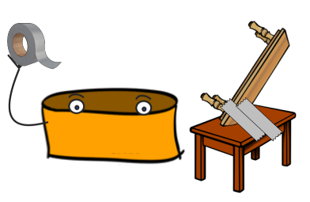
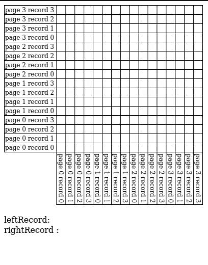
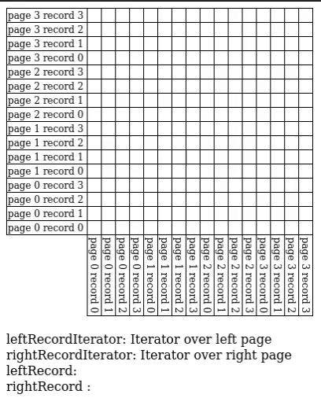
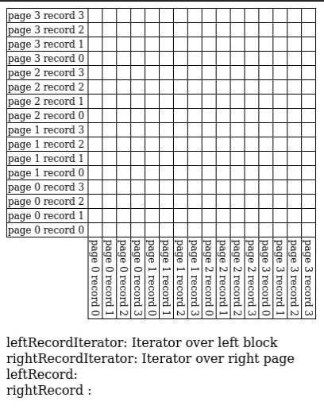
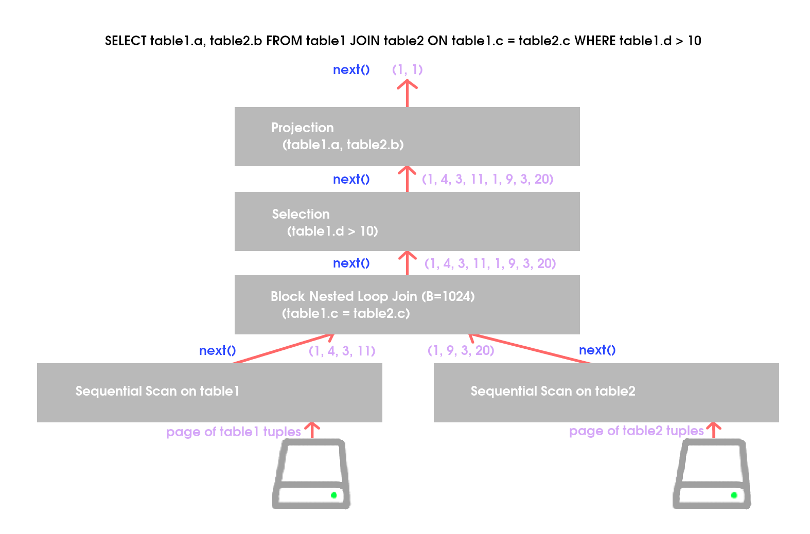

# Joins and Query Optimization
<p align="center">


## Overview
There are two parts in this project. In the first part I implemented some join algorithms: block nested loop join, sort merge, and grace hash join. In the second part, I implemented a piece of a relational query optimizer: Plan space search.

### Contents
- [Part 1: Join Algorithms](https://github.com/JC01111/Database-Management-System/tree/main/src/main/java/edu/berkeley/cs186/database/query#part-1-join-algorithms)
    - [1. Nested Loop Joins](https://github.com/JC01111/Database-Management-System/tree/main/src/main/java/edu/berkeley/cs186/database/query#1-nested-loop-joins)
        - [Simple Nested Loop Join \(SNLJ\)](https://github.com/JC01111/Database-Management-System/tree/main/src/main/java/edu/berkeley/cs186/database/query#simple-nested-loop-join-snlj)
        - [Page Nested Loop Join \(PNLJ\)](https://github.com/JC01111/Database-Management-System/tree/main/src/main/java/edu/berkeley/cs186/database/query#page-nested-loop-join-pnlj)
        - [Block Nested Loop Join \(BNLJ\)](https://github.com/JC01111/Database-Management-System/tree/main/src/main/java/edu/berkeley/cs186/database/query#block-nested-loop-join-bnlj)
    - [2. Hash Joins](https://github.com/JC01111/Database-Management-System/tree/main/src/main/java/edu/berkeley/cs186/database/query#2-hash-joins)
        - [Simple Hash Join \(SHJ\)](https://github.com/JC01111/Database-Management-System/tree/main/src/main/java/edu/berkeley/cs186/database/query#simple-hash-join-shj)
        - [Grace Hash Join \(GHJ\)](https://github.com/JC01111/Database-Management-System/tree/main/src/main/java/edu/berkeley/cs186/database/query#grace-hash-join-ghj)
    - [3. External Sort](https://github.com/JC01111/Database-Management-System/tree/main/src/main/java/edu/berkeley/cs186/database/query#3-external-sort)
    - [4. Sort Merge Join (SMJ)](https://github.com/JC01111/Database-Management-System/tree/main/src/main/java/edu/berkeley/cs186/database/query#4-sort-merge-join)
- [Part 2: Query Optimization](https://github.com/JC01111/Database-Management-System/tree/main/src/main/java/edu/berkeley/cs186/database/query#part-2-query-optimization)
    - [Overview: Plan Space Search](https://github.com/JC01111/Database-Management-System/tree/main/src/main/java/edu/berkeley/cs186/database/query#overview-plan-space-search)
    - [Visualizing the Naive Query Optimizer](https://github.com/JC01111/Database-Management-System/tree/main/src/main/java/edu/berkeley/cs186/database/query#visualizing-the-naive-query-optimizer)
    - [5. Single Table Access Selection (Pass 1)](https://github.com/JC01111/Database-Management-System/tree/main/src/main/java/edu/berkeley/cs186/database/query#5-single-table-access-selection-pass-1)
    - [6. Join Selection (Pass i > 1)](https://github.com/JC01111/Database-Management-System/tree/main/src/main/java/edu/berkeley/cs186/database/query#6-join-selection-pass-i--1)
    - [7. Optimal Plan Selection](https://github.com/JC01111/Database-Management-System/tree/main/src/main/java/edu/berkeley/cs186/database/query#7-optimal-plan-selection)
    - [Visualizing the Query Optimizer](https://github.com/JC01111/Database-Management-System/tree/main/src/main/java/edu/berkeley/cs186/database/query#visualizing-the-query-optimizer)

## Part 1: Join Algorithms
### 1. Nested Loop Joins

#### Simple Nested Loop Join \(SNLJ\)

SNLJ has already been implemented in [`SNLJOperator`](./join/SNLJOperator.java). Although each join algorithm should return the same data, the order differs between each join algorithm, as does the structure of the code. In particular, SNLJ does not need to explicitly manage pages of data \(it only ever needs the next record of each table, and therefore can just use an iterator over all records in a table\), whereas all the algorithms in this part must explicitly manage when pages of data are fetched from disk.
<p align="center">


#### Page Nested Loop Join \(PNLJ\)

[`PNLJ`](./join/PNLJOperator.java) has already been implemented as a special case of BNLJ with B=3. Therefore, it will not function properly until BNLJ has been properly implemented. The test cases for both PNLJ and BNLJ in `TestNestedLoopJoin` depend on a properly implemented BNLJ.
<p align="center">


#### Block Nested Loop Join \(BNLJ\)

I implemented the [`fetchNextRecord`](https://github.com/JC01111/Database-Management-System/blob/a45f039458ed48bcb2789133d5e9657fecfb589d/src/main/java/edu/berkeley/cs186/database/query/join/BNLJOperator.java#L129) method, which should do most of the heavy lifting of the BNLJ algorithm.

There are two helper methods: [`fetchNextLeftBlock`](https://github.com/JC01111/Database-Management-System/blob/a45f039458ed48bcb2789133d5e9657fecfb589d/src/main/java/edu/berkeley/cs186/database/query/join/BNLJOperator.java#L89), which fetches the next non-empty block of left table pages from `leftSourceIterator`, and [`fetchNextRightPage`](https://github.com/JC01111/Database-Management-System/blob/a45f039458ed48bcb2789133d5e9657fecfb589d/src/main/java/edu/berkeley/cs186/database/query/join/BNLJOperator.java#L111), which fetches the next non-empty page of the right table from `rightSourceIterator`.

The `fetchNextRecord` method should fetch the next record of the join output. When implementing this method there are 4 important cases you should consider:

* Case 1: The right page iterator has a value to yield
* Case 2: The right page iterator doesn't have a value to yield but the left block iterator does
* Case 3: Neither the right page nor left block iterators have values to yield, but there's more right pages
* Case 4: Neither right page nor left block iterators have values nor are there more right pages, but there are still left blocks

Here is an animation of how the blocks, pages, and records are traversed during the nested looping process. Identifying where each of these cases take place in the diagram may help guide on what to do in each case.

<p align="center">


Loaded left records are highlighted in blue, while loaded orange records are highlighted in orange. The dark purple square represents which pair of records are being considered for the join, while light purple shows which pairs have already been considered.

After implementing `BNLJOperator`, all the tests in `TestNestedLoopJoin` should pass.

### 2. Hash Joins

#### Simple Hash Join \(SHJ\)
Here is an implementation of Simple Hash Join in [`SHJOperator.java`](./join/SHJOperator.java). Simple Hash Join performs a single pass of partitioning on only the left records before attempting to join. The code for SHJ gives a good idea of how to implement Grace Hash Join.

#### Grace Hash Join \(GHJ\)
I implemented Grace Hash Join in [`GHJOperator.java`](./join/GHJOperator.java). I implemented the functions [`partition`](https://github.com/JC01111/Database-Management-System/blob/a45f039458ed48bcb2789133d5e9657fecfb589d/src/main/java/edu/berkeley/cs186/database/query/join/GHJOperator.java#L69), [`buildAndProbe`](https://github.com/JC01111/Database-Management-System/blob/a45f039458ed48bcb2789133d5e9657fecfb589d/src/main/java/edu/berkeley/cs186/database/query/join/GHJOperator.java#L101), and [`run`](https://github.com/JC01111/Database-Management-System/blob/a45f039458ed48bcb2789133d5e9657fecfb589d/src/main/java/edu/berkeley/cs186/database/query/join/GHJOperator.java#L172). Additionally, I provided some inputs in [`getBreakSHJInputs`](https://github.com/JC01111/Database-Management-System/blob/a45f039458ed48bcb2789133d5e9657fecfb589d/src/main/java/edu/berkeley/cs186/database/query/join/GHJOperator.java#L254) and [`getBreakGHJInputs`](https://github.com/JC01111/Database-Management-System/blob/a45f039458ed48bcb2789133d5e9657fecfb589d/src/main/java/edu/berkeley/cs186/database/query/join/GHJOperator.java#L284) which will be used to test that Simple Hash Join fails but Grace Hash Join passes \(tested in `testBreakSHJButPassGHJ`\) and that GHJ breaks \(tested in `testGHJBreak`\) respectively.

The file `Partition.java` in the `query/disk` directory will be useful when working with partitions.

After implementing all the methods in `GHJOperator.java`, all tests in `TestGraceHashJoin.java` will pass.

### 3. External Sort
The first step in Sort Merge Join is to sort both input relations. Therefore, before you can work on implementing Sort Merge Join, you must first implement an external sorting algorithm.

Recall that a "run" in the context of external mergesort is just a sequence of sorted records. This is represented in `SortOperator` by the `Run` class \(located in `query/disk/Run.java`\). As runs in external mergesort can span many pages \(and eventually span the entirety of the table\), the `Run` class does not keep all its data in memory. Rather, it creates a temporary table and writes all of its data to the temporary table \(which is materialized to disk at the buffer manager's discretion\).

I implemented the `sortRun`, `mergeSortedRuns`, `mergePass`, and `sort` methods of [`SortOperator`](../query/SortOperator.java).

* [`sortRun(run)`](https://github.com/JC01111/Database-Management-System/blob/a45f039458ed48bcb2789133d5e9657fecfb589d/src/main/java/edu/berkeley/cs186/database/query/SortOperator.java#L88) should sort the passed in data using an in-memory sort \(Pass 0 of external mergesort\).
* [`mergeSortedRuns(runs)`](https://github.com/JC01111/Database-Management-System/blob/a45f039458ed48bcb2789133d5e9657fecfb589d/src/main/java/edu/berkeley/cs186/database/query/SortOperator.java#L108) should return a new run given a list of sorted runs.
* [`mergePass(runs)`](https://github.com/JC01111/Database-Management-System/blob/a45f039458ed48bcb2789133d5e9657fecfb589d/src/main/java/edu/berkeley/cs186/database/query/SortOperator.java#L134) should perform a single merge pass of external mergesort, given a list of all the sorted runs from the previous pass.
* [`sort()`](https://github.com/JC01111/Database-Management-System/blob/a45f039458ed48bcb2789133d5e9657fecfb589d/src/main/java/edu/berkeley/cs186/database/query/SortOperator.java#L147) should run external mergesort from start to finish, and return the final run with the sorted data

After implementing all four methods, all the tests in `TestSortOperator` should pass.

### 4. Sort Merge Join
Now we can implement Sort Merge Join \(SMJ\).

For simplicity, my implementation of SMJ does _not_ utilize the optimization in any case \(where the final merge pass of sorting happens at the same time as the join\). Therefore, I used `SortOperator` to sort during the sort phase of SMJ.

I implemented the [`SortMergeIterator`](https://github.com/JC01111/Database-Management-System/blob/a45f039458ed48bcb2789133d5e9657fecfb589d/src/main/java/edu/berkeley/cs186/database/query/join/SortMergeOperator.java#L88) inner class of `SortMergeOperator`.

After implementing `SortMergeIterator`, all the tests in `TestSortMergeJoin` should pass.

## Part 2: Query Optimization
<p align="center">


In this part, I implemented a piece of a relational query optimizer: Plan space search.

<p align="center">


### Overview: Plan Space Search

You will now search the plan space of some cost estimates. For our database, this is similar to System R: the set of all left-deep trees, avoiding Cartesian products where possible. Unlike System R, we do not consider interesting orders, and further, we completely disallow Cartesian products in all queries. To search the plan space, we will utilize the dynamic programming algorithm used in the Selinger optimizer.

Before you begin, you should have a good idea of how the `QueryPlan` class is used and how query operators fit together. For example, to implement a simple query with a single selection predicate:

```java
/**
 * SELECT * FROM myTableName WHERE stringAttr = 'CS 186'
 */
QueryOperator source = SequentialScanOperator(transaction, myTableName);
QueryOperator select = SelectOperator(source, 'stringAttr', PredicateOperator.EQUALS, "CS 186");

int estimatedIOCost = select.estimateIOCost(); // estimate I/O cost
Iterator<Record> iter = select.iterator(); // iterator over the results
```

A tree of `QueryOperator` objects is formed when we have multiple tables joined together. The current implementation of `QueryPlan#execute`, which is called by the user to run the query, is to join all tables in the order given by the user: if the user says `SELECT * FROM t1 JOIN t2 ON .. JOIN t3 ON ..`, then it scans `t1`, then joins `t2`, then joins `t3`. This will perform poorly in many cases, so your task is to implement the dynamic programming algorithm to join the tables together in a better order.

You will have to implement the [`QueryPlan#execute`](https://github.com/JC01111/Database-Management-System/blob/a45f039458ed48bcb2789133d5e9657fecfb589d/src/main/java/edu/berkeley/cs186/database/query/QueryPlan.java#L746) method. To do so, you will also have to implement two helper methods: [`QueryPlan#minCostSingleAccess`](https://github.com/JC01111/Database-Management-System/blob/a45f039458ed48bcb2789133d5e9657fecfb589d/src/main/java/edu/berkeley/cs186/database/query/QueryPlan.java#L576) \(pass 1 of the dynamic programming algorithm\) and `QueryPlan#minCostJoins` \(pass i &gt; 1\).

### Visualizing the Naive Query Optimizer
Our database supports an `EXPLAIN` command which outputs the query plan for a given query. Let's test out our current query optimizer! Navigate to `CommandLineInterface.java` and run the code to start our CLI. This should open a new panel in IntelliJ at the bottom. Click on this panel. We've provided 3 demo tables (Students, Courses, Enrollments). Let's try running the following query:

```sql
SELECT * FROM Students AS s INNER JOIN Enrollments AS e ON s.sid = e.sid;
```

Let's display the query plan used to execute the above query by running the following command:

```sql
EXPLAIN SELECT * FROM Students AS s INNER JOIN Enrollments AS e ON s.sid = e.sid;
```

An estimated 603 I/Os, a very costly query! Our current naive query optimizer joins the table in the order given and only uses SNLJs for joins, which can become very expensive. Let's try a more complex query. The following computes the distribution of majors in CS186.

```sql
SELECT c.name, s.major, COUNT(*) FROM Students AS s INNER JOIN Enrollments AS e ON s.sid = e.sid INNER JOIN Courses AS c ON e.cid = c.cid WHERE c.name = 'CS 186' GROUP BY s.major, c.name;
```

Like before, let's inspect the query plan.

```sql
EXPLAIN SELECT c.name, s.major, COUNT(*) FROM Students AS s INNER JOIN Enrollments AS e ON s.sid = e.sid INNER JOIN Courses AS c ON e.cid = c.cid WHERE c.name = 'CS 186' GROUP BY s.major, c.name;
```

This query also performs very poorly. Run `exit` to terminate the CLI. In the next few tasks, we'll implement an optimizer that will drastically improve the cost of our queries!

### 5. Single Table Access Selection \(Pass 1\)
Recall that the first part of the search algorithm involves finding the lowest estimated cost plans for accessing each table individually \(pass i involves finding the best plans for sets of i tables, so pass 1 involves finding the best plans for sets of 1 table\).

This functionality is implemented in the [`QueryPlan#minCostSingleAccess`](https://github.com/JC01111/Database-Management-System/blob/a45f039458ed48bcb2789133d5e9657fecfb589d/src/main/java/edu/berkeley/cs186/database/query/QueryPlan.java#L576) helper method, which takes a table and returns the optimal [`QueryOperator`](https://github.com/JC01111/Database-Management-System/blob/a45f039458ed48bcb2789133d5e9657fecfb589d/src/main/java/edu/berkeley/cs186/database/query/QueryOperator.java) for scanning the table.

In our database, we only consider two types of table scans: a sequential, full table scan \([`SequentialScanOperator`](https://github.com/JC01111/Database-Management-System/blob/a45f039458ed48bcb2789133d5e9657fecfb589d/src/main/java/edu/berkeley/cs186/database/query/SequentialScanOperator.java)\) and an index scan \([`IndexScanOperator`](https://github.com/JC01111/Database-Management-System/blob/a45f039458ed48bcb2789133d5e9657fecfb589d/src/main/java/edu/berkeley/cs186/database/query/IndexScanOperator.java)\), which requires an index and filtering predicate on a column.

You should first calculate the estimated I/O cost of a sequential scan, since this is always possible \(it's the default option: we only move away from it in favor of index scans if the index scan is both possible and more efficient\).

Then, if there are any indices on any column of the table that we have a selection predicate on, you should calculate the estimated I/O cost of doing an index scan on that column. If any of these are more efficient than the sequential scan, take the best one.

Finally, as part of a heuristic-based optimization, you should push down any selection predicates that involve solely the table \(see [`QueryPlan#addEligibleSelections`](https://github.com/JC01111/Database-Management-System/blob/a45f039458ed48bcb2789133d5e9657fecfb589d/src/main/java/edu/berkeley/cs186/database/query/QueryPlan.java#L543)\).

This should leave you with a query operator beginning with a sequential or index scan operator, followed by zero or more `SelectOperator`s.

After implementing `QueryPlan#minCostSingleAccess`, all of the tests in `TestSingleAccess` should be passed. These tests do not involve any joins.

### 6. Join Selection \(Pass i &gt; 1\)

Recall that for i &gt; 1, pass i of the dynamic programming algorithm takes in optimal plans for joining together all possible sets of i - 1 tables \(except those involving cartesian products\), and returns optimal plans for joining together all possible sets of i tables \(again excluding those with cartesian products\).

We represent the state between two passes as a mapping from sets of strings \(table names\) to the corresponding optimal `QueryOperator`. You will need to implement the logic for pass i \(i &gt; 1\) of the search algorithm in the [`QueryPlan#minCostJoins`](https://github.com/JC01111/Database-Management-System/blob/a45f039458ed48bcb2789133d5e9657fecfb589d/src/main/java/edu/berkeley/cs186/database/query/QueryPlan.java#L644) helper method.

This method should, given a mapping from sets of i - 1 tables to the optimal plan for joining together those i - 1 tables, return a mapping from sets of i tables to the optimal left-deep plan for joining all sets of i tables \(except those with cartesian products\).

You should use the list of explicit join conditions added when the user calls the [`QueryPlan#join`](https://github.com/JC01111/Database-Management-System/blob/a45f039458ed48bcb2789133d5e9657fecfb589d/src/main/java/edu/berkeley/cs186/database/query/QueryPlan.java#L453) method to identify potential joins.

After implementing this method you should be passing `TestOptimizationJoins#testMinCostJoins`

**Note:** you should not add any selection predicates in this method. This is because in our database, we only allow two column predicates in the join condition, and a conjunction of single column predicates otherwise, so the only unprocessed selection predicates in pass i &gt; 1 are the join conditions. _This is not generally the case!_ SQL queries can contain selection predicates that can _not_ be processed until multiple tables have been joined together, for example:

```sql
SELECT * FROM t1, t2, t3, t4 WHERE (t1.a = t2.b OR t2.b = t2.c)
```

where the single predicate cannot be evaluated until after `t1`, `t2`, _and_ `t3` have been joined together. Therefore, a database that supports all of SQL would have to push down predicates after each pass of the search algorithm.

### 7. Optimal Plan Selection
The final task is to write the outermost driver method of the optimizer, [`QueryPlan#execute`](https://github.com/JC01111/Database-Management-System/blob/a45f039458ed48bcb2789133d5e9657fecfb589d/src/main/java/edu/berkeley/cs186/database/query/QueryPlan.java#L746), which should utilize the two helper methods you have implemented to find the best query plan.

You will need to add the remaining group by and projection operators that are a part of the query, but have not yet been added to the query plan \(see the private helper methods implemented for you in the `QueryPlan` class\).

**Note:** The tables in `QueryPlan` are kept in the variable `tableNames`. 

After this, all the tests in `database.query.*` should be passed.

### Visualizing the Query Optimizer
Now that we've finished implementing a better query optimizer, let's visualize the results and compare it with the naive query optimizer! Navigate to `CommandLineInterface.java` and run the code to start our CLI. Let's try running the following two queries again:

```sql
EXPLAIN SELECT * FROM Students AS s INNER JOIN Enrollments AS e ON s.sid = e.sid;
```

```sql
EXPLAIN SELECT c.name, s.major, COUNT(*) FROM Students AS s INNER JOIN Enrollments AS e ON s.sid = e.sid INNER JOIN Courses AS c ON e.cid = c.cid WHERE c.name = 'CS 186' GROUP BY s.major, c.name;
```

The outputted query plans are much better than before! Notice how we now push down selects and use more efficient joins.
