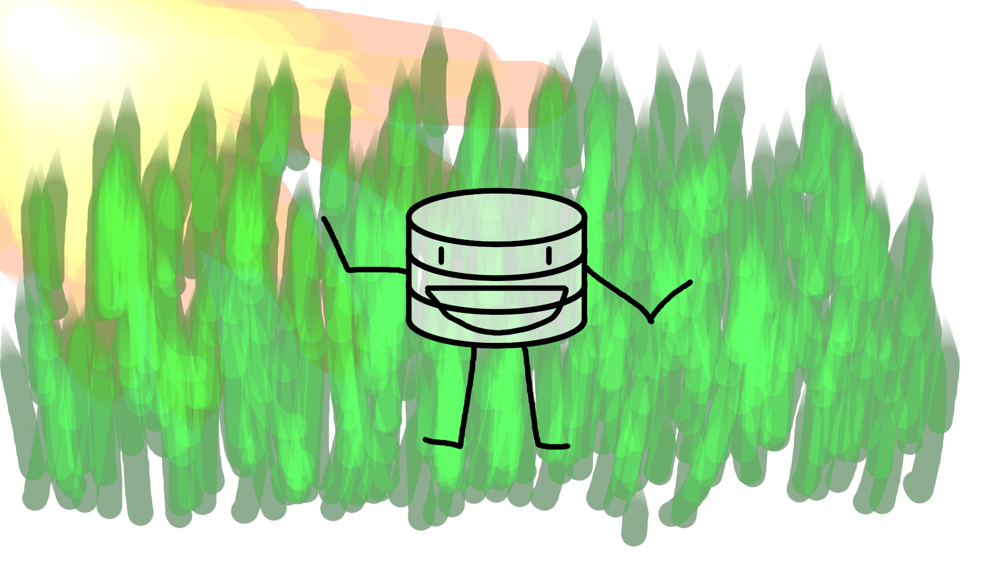
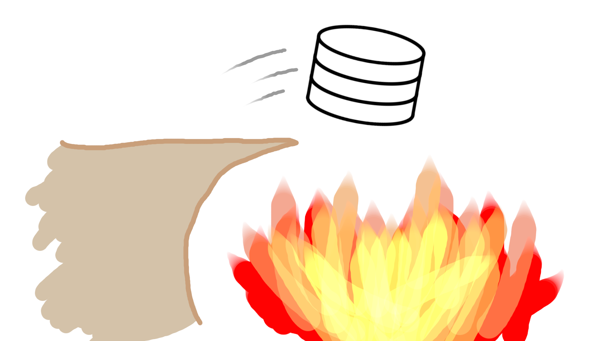

# Recovery
In this project, I implemented write-ahead logging and support for savepoints, rollbacks, and ACID compliant restart recovery. Here is a helpful reading [recovery notes](https://cs186berkeley.net/notes/note14/) and referencing them as needed while you work through this project. The tests for this project are all located in [`TestRecoveryManager.java`](../../../../../../../test/java/edu/berkeley/cs186/database/recovery/TestRecoveryManager.java).

This project will be centered around [`ARIESRecoveryManager.java`](https://github.com/JC01111/Database-Management-System/blob/a45f039458ed48bcb2789133d5e9657fecfb589d/src/main/java/edu/berkeley/cs186/database/recovery/ARIESRecoveryManager.java), which implements the `RecoveryManager` interface.

There are two distinct modes of operation: 1. __forward processing__ where we perform logging and maintain some metadata such as the dirty page table and transaction table during normal operation of the database, and 2. __restart recovery__ (a.k.a. crash recovery), which consists of the processes taken when the database starts up again. During normal operation, the rest of the database calls various methods of the recovery manager to indicate that certain operations (e.g. a page write or flush) have occurred. During a restart, the `restart` method is called, which should bring the database back to a valid state.

### Contents
- [Forward Processing]()
    - [1. Transaction Status]()
    - [2. Logging]()
    - [3. Savepoints]()
    - [4. Checkpoints]()
- [Restart Recovery]()
    - [5. Analysis]()
    - [6. Redo]()
    - [7. Undo]()

## Forward Processing
<p align="center">


When the database is undergoing normal operation - where transactions are running normally, reading and writing data - the job of the recovery manager is to maintain the log by adding log records and ensuring that the log is properly flushed when necessary so that we can recover from a crash at any time.

#### Initialization
At the time the database is first created, before any transactions run, the recovery manager needs to first set the log up, which is done in the [`initialize`](https://github.com/JC01111/Database-Management-System/blob/a45f039458ed48bcb2789133d5e9657fecfb589d/src/main/java/edu/berkeley/cs186/database/recovery/ARIESRecoveryManager.java#L49) method in `ARIESRecoveryManager.java`. We store the _master record_ as the very first log record in the log, at LSN 0 (recall that the master record stores the LSN of the begin checkpoint record of the most recent successful checkpoint).To simplify things when implementing the analysis phase of restart recovery, we also immediately perform a checkpoint, writing a begin and end checkpoint record in succession, and updating the master record. This has been implemented for you.

### 1. Transaction Status
Part of the recovery manager's job during forward processing is to maintain the status of running transactions, and log changes in transaction status. The recovery manager is notified of changes in transaction status through three methods:

* [`commit`](https://github.com/JC01111/Database-Management-System/blob/a45f039458ed48bcb2789133d5e9657fecfb589d/src/main/java/edu/berkeley/cs186/database/recovery/ARIESRecoveryManager.java#L95) is called when a transaction attempts to move into the `COMMITTING` state.
* [`abort`](https://github.com/JC01111/Database-Management-System/blob/a45f039458ed48bcb2789133d5e9657fecfb589d/src/main/java/edu/berkeley/cs186/database/recovery/ARIESRecoveryManager.java#L120) is called when a transaction attempts to move into the `ABORTING` state.
* [`end`](https://github.com/JC01111/Database-Management-System/blob/a45f039458ed48bcb2789133d5e9657fecfb589d/src/main/java/edu/berkeley/cs186/database/recovery/ARIESRecoveryManager.java#L144) is called when a transaction attempts to move into the `COMPLETE` state.

The three methods (`commit`, `abort`, `end`) need to keep the transaction table up-to-date, set the status of the transaction accordingly, and write the appropriate log record to the log (check the `records/` directory for the types of logs you can create). During this task you should get into the habit of **updating the lastLSN** in the transaction table whenever you append a log for a transaction's operation. This includes status change records, update records, and CLRs.

I also implemented:

* In `commit` the commit record needs to be flushed to disk before the commit call returns to ensure durability.
* In `end` if the transaction ends in an abort, all changes must be rolled back before an EndTransaction record is written. Look at the docstring for `rollbackToLSN` for details on how to rollback, and think about what LSN you can pass into this function to completely rollback a transaction.

Some helper functions you may find useful for this task:

* `LogManager#fetchLogRecord`
* `LogManager#appendToLog`
* `LogManager#flushToLSN`
* `Transaction#setStatus`
* `LogRecord#isUndoable`
* `LogRecord#undo`

After completing this task you should pass `testAbort` and `testAbortingEnd`.

### 2. Logging
During normal operation several methods are called when certain events happen:

* `logAllocPart`, `logFreePart`, `logAllocPage`, `logFreePage`: these are called by the disk space manager whenever someone tries to create or delete a partition or page, and should append the appropriate log record, and have been implemented for you.
* `logPageWrite` is called by the buffer manager whenever someone tries to write to part of a page, and will be implemented by you. Your implementation should create and append an appropriate log record and update the transaction table and dirty page table accordingly.

All of these methods should keep the tables maintained by the recovery manager up-to-date (the dirty page table and transaction table).

After completing this task the following tests should be passing: `testEnd`, `testSimpleCommit`, `testSimpleLogPageWrite`.

### 3. Savepoints
SQL has [savepoints](https://www.postgresql.org/docs/9.6/sql-savepoint.html) to allow for _partial rollback_: `SAVEPOINT pomelo` creates a savepoint named `pomelo` for the current running transaction, allowing a user to rollback all changes made after the savepoint by using `ROLLBACK TO SAVEPOINT pomelo`. The savepoint can be deleted with `RELEASE SAVEPOINT pomelo`.

Write-ahead logging lets us implement savepoints. The recovery manager has three methods related to savepoints, which correspond to the three SQL statements for savepoints, and follow the semantics of the corresponding SQL statements:

* `savepoint` creates a savepoint for the current transaction with the specified name. As with the `SAVEPOINT` statement in SQL, the name of the savepoint is scoped to the transaction: two different transactions may have their own savepoint called `pomelo`.
* `releaseSavepoint` deletes a specific savepoint for the current transaction; it behaves the same as the `RELEASE SAVEPOINT` statement in SQL.
*   `rollbackToSavepoint` rolls the transaction back to the specified savepoint. All changes done after the savepoint should be undone, similarly to an aborting transaction, except the status of the transaction does not change; it behaves the same way as the `ROLLBACK TO SAVEPOINT` statement in SQL.

    See Transaction Status for more details on undoing changes.

The skeleton code has provided most of the implementation of savepoints for you - all that is left is to implement the logic for undoing changes in [`rollbackToSavepoint`](https://github.com/JC01111/Database-Management-System/blob/a45f039458ed48bcb2789133d5e9657fecfb589d/src/main/java/edu/berkeley/cs186/database/recovery/ARIESRecoveryManager.java#L422). This is extremely similar to the undo logic in `end()`, so if you already implemented the `rollbackToLSN` method to complete Task 1 you should be able to reuse that helper here.

After completing this task `testSimpleSavepoint` and `testNestedRollback` should be passing.

### 4. Checkpoints
In ARIES, we periodically perform _fuzzy checkpoints_ which occur even while other transactions run, to minimize recovery time after a crash, without bringing the database to a halt during forward processing.

The approach is outlined below.

1. First, a begin checkpoint record is added to the log.

2. Then, we write end checkpoint records, accounting for the fact that we may have to break up end checkpoint records due to too many DPT/Xact table entries.

3. An end checkpoint record should be written even if all tables are empty, and multiple end checkpoint records should only be written if necessary.

This is done as follows:

* iterate through the dirtyPageTable and copy the entries. If at any point, copying the current record would cause the end checkpoint record to be too large, an end checkpoint record with the copied DPT entries should be appended to the log.
* iterate through the transaction table, and copy the status/lastLSN, outputting end checkpoint records only as needed.
* output one final end checkpoint.

Finally, we must rewrite the master record with the LSN of the begin checkpoint record of the new successful checkpoint.

As an example, if we had 200 DPT entries and 300 transaction table entries, we would output the following end checkpoint records in the following order:

* EndCheckpoint with 200 DPT entries and 52 transaction table entries
* EndCheckpoint with 240 transaction table entries
* EndCheckpoint with 8 transaction table entries

(If an end checkpoint has 200 DPT entries, a maximum of 52 table entries can fit in the remaining space. A maximum of 240 transaction table entries can fit in a single end checkpoint.)

You may find the `EndCheckpoint.fitsInOneRecord` static method useful for this; it takes in two parameters:

* the number of dirty page table entries stored in the record,
*   the number of transaction number/status/lastLSN entries stored in the record and returns whether the resulting record would fit in one page.

For example, for the record:

```
EndCheckpoint{
  dpt={1 => 30000, 2 => 33000, 3 => 34000},
  txnTable={1 => (RUNNING, 33000), 2 => (RUNNING, 34000)}
}
```

the corresponding call is:

```java
EndCheckpoint.fitsInOneRecord(3, 2); // # of dpt entries, # of txnTable entries
```

## Restart Recovery
<p align="center">


When the database starts up again, it enters restart recovery. This involves three phases: analysis, redo, and undo. The `RecoveryManager` interface exposes a single method for restart recovery: the [`restart`](https://github.com/JC01111/Database-Management-System/blob/a45f039458ed48bcb2789133d5e9657fecfb589d/src/main/java/edu/berkeley/cs186/database/recovery/ARIESRecoveryManager.java#L538) method, which is called when the database starts up.

In order to test each phase in isolation, I also implemented: [`restartAnalysis`](https://github.com/JC01111/Database-Management-System/blob/a45f039458ed48bcb2789133d5e9657fecfb589d/src/main/java/edu/berkeley/cs186/database/recovery/ARIESRecoveryManager.java#L588), [`restartRedo`](https://github.com/JC01111/Database-Management-System/blob/a45f039458ed48bcb2789133d5e9657fecfb589d/src/main/java/edu/berkeley/cs186/database/recovery/ARIESRecoveryManager.java#L699), and [`restartUndo`](https://github.com/JC01111/Database-Management-System/blob/a45f039458ed48bcb2789133d5e9657fecfb589d/src/main/java/edu/berkeley/cs186/database/recovery/ARIESRecoveryManager.java#L746), which perform the analysis, redo, and undo phases respectively for restart recovery.

In addition to the three phases of recovery, the [`restart`](https://github.com/JC01111/Database-Management-System/blob/a45f039458ed48bcb2789133d5e9657fecfb589d/src/main/java/edu/berkeley/cs186/database/recovery/ARIESRecoveryManager.java#L538) method does two things:

* between the redo and undo phases, any page in the dirty page table that isn't actually dirty (has changes in-memory that have not been flushed) should be removed from the dirty page table. These pages may be present in the DPT as a result of the analysis phase, if we are uncertain about whether a change has been flushed to disk successfully or not.
* after the undo phase, recovery has finished. To avoid having to abort all the transactions again should we crash, we take a checkpoint.

### 5. Analysis
This section concerns just the [`restartAnalysis`]((https://github.com/JC01111/Database-Management-System/blob/a45f039458ed48bcb2789133d5e9657fecfb589d/src/main/java/edu/berkeley/cs186/database/recovery/ARIESRecoveryManager.java#L588)) method, which performs the analysis pass of restart recovery.

**Master Record**

To begin analysis, the master record needs to be fetched, in order to find the LSN of the checkpoint to start at (recall that in `initialize`, a checkpoint was written near the start of the log, so there is always a checkpoint to start at).

**Scanning the Log**

The goal of analysis is to reconstruct the dirty page table and transaction table from the log.

The many types of log records encountered while scanning fall into three categories: log records for operations that a transaction does, checkpoint records, and log records for transaction status changes (commit/abort/end). (There is also the master record, but it should never come up while scanning the log).

**Log Records for Transaction Operations**

These are the records that involve a transaction, and therefore, we need to update the transaction table whenever we encounter one of these records. The following applies to any record with a non-empty result for `LogRecord#getTransNum()`

* If the transaction is not in the transaction table, it should be added to the table (the `newTransaction` function object can be used to create a `Transaction` object, which can be passed to `startTransaction`).
* The lastLSN of the transaction should be updated.

**Log Records for Page Operations**

The dirty page table will need to be updated for certain page-related log records:

* UpdatePage/UndoUpdatePage both may dirty a page in memory, without flushing changes to disk.
* FreePage/UndoAllocPage both make their changes visible on disk immediately, and can be seen as flushing the freed page to disk (remove page from DPT)
* You don't need to do anything for AllocPage/UndoFreePage
  * If you're curious about how the data from before the page was freed is restored in this case, we work around this by always writing an update log records that go from \[old bytes] -> \[zeroes] right before freeing the page. After undoing the free page, undoing these updates would restore the old bytes (\[zeroes] -> \[old\_bytes]).

**Log Records for Transaction Status Changes**

These three types of log records (CommitTransaction/AbortTransaction/EndTransaction) all change the status of a transaction.

When one of these records are encountered, the transaction table should be updated as described in the previous section. The status of the transaction should also be set to one of `COMMITTING`, `RECOVERY_ABORTING`, or `COMPLETE`.

If the record is an EndTransaction record, the transaction should also be cleaned up before setting the status, and the entry should be removed from the transaction table. Additionally, you should add the ended transaction's transaction number into the `endedTransactions` set, which will be important for processing end checkpoint records.

**Checkpoint Records**

When a BeginCheckpoint record is encountered, no action is required.

When an EndCheckpoint record is encountered, the tables stored in the record should be combined with the tables currently in memory:

For each entry in the checkpoint's snapshot of the dirty page table:

* The recLSN of a page in the checkpoint should always be used, even if we have a record in the dirty page table already, since the checkpoint is always more accurate than anything we can infer from just the log.

For each entry in the checkpoint's snapshot of the transaction table:

* Before updating a transaction table entry, check if the corresponding transaction is already in `endedTransactions`. If so, the transaction is already complete and the entry can be ignored, since any information it contains is no longer relevant. Otherwise:
* If we don't have a corresponding entry for the transaction in our reconstruction of the transaction table, it should be added (the `newTransaction` function object can be used to create a `Transaction` object, which can be passed to `startTransaction`).
* The lastLSN of a transaction in the checkpoint should be used if it is greater than or equal to the lastLSN of the transaction in the in-memory transaction table.

Additionally, the status of transactions should be updated. Remember that checkpoints are fuzzy, meaning that they capture state from any time between the begin and end records. This means some of the transaction status's stored in the record may be out of date, e.g. the checkpoint may say a transaction is running when we already know that its aborting. Transactions will always advance through states in one of two ways:

* running -> committing -> complete
* running -> aborting -> complete

You should only update a transaction's status if the status in the checkpoint is more "advanced" than the status in memory. Some examples:

* if the checkpoint says a transaction is aborting and our in-memory table says its running, we should update the in-memory status to recovery aborting\* because its possible to transition from running to aborting.
* if the checkpoint says a transaction is running and our in-memory table says its committing, we wouldn't update our in-memory table. There's no way for the status to change from committing to running in normal operation, and so the checkpoint status must be out-of-date.

\* Make sure that you set to recovery aborting instead of aborting if the checkpoint says aborting

**Ending Transactions**

The transaction table at this point should have transactions that are in one of the following states: `RUNNING`, `COMMITTING`, or `RECOVERY_ABORTING`.

* All transactions in the `COMMITTING` state should be ended (`cleanup()`, state set to `COMPLETE`, end transaction record written, and removed from the transaction table).
* All transactions in the `RUNNING` state should be moved into the `RECOVERY_ABORTING` state, and an abort transaction record should be written.
* Nothing needs to be done for transactions in the `RECOVERY_ABORTING` state.

After completing this task you should be passing `testRestartAnalysis` and `testAnalysisCheckpoints`.

### 6. Redo
This section concerns just the [`restartRedo`]((https://github.com/JC01111/Database-Management-System/blob/a45f039458ed48bcb2789133d5e9657fecfb589d/src/main/java/edu/berkeley/cs186/database/recovery/ARIESRecoveryManager.java#L699)) method, which performs the redo pass of restart recovery. Recall from lecture that the redo phase begins at the lowest recLSN in the dirty page table. Scanning from that point on, we redo a record if it is redoable and if it is either:

* a partition-related record (AllocPart, UndoAllocPart, FreePart, UndoFreePart)
* a record that allocates a page (AllocPage, UndoFreePage)
* a record that modifies a page (UpdatePage, UndoUpdatePage, UndoAllocPage, FreePage) where all of the following hold:
  * the page is in the DPT
  * the record's LSN is greater than or equal to the DPT's recLSN for that page.
  * the pageLSN on the page itself is strictly less than the LSN of the record.

In order to check the pageLSN of a page, you'll need to fetch it from the buffer manager. We recommend you use the following template:

```
Page page = bufferManager.fetchPage(new DummyLockContext(), pageNum);
try {
    // Do anything that requires the page here
} finally {
    page.unpin();
}
```

The buffer manager always returns a pinned page which is why we use a try-finally block to ensure that the page is always unpinned once we're done using it. Note that we can use a dummy lock context here without worrying about isolation issues since no other operations can run at the same time as the redo phase. You may find [this method](https://github.com/berkeley-cs186/sp24-rookiedb/blob/master/src/main/java/edu/berkeley/cs186/database/memory/Page.java#L164-L169) of the Page class useful here.

Be sure to account for the case where `restartRedo` is called on an empty log!

After finishing this task you should be passing `testRestartRedo`.

### 7. Undo

This section concerns just the [`restartUndo`]((https://github.com/JC01111/Database-Management-System/blob/a45f039458ed48bcb2789133d5e9657fecfb589d/src/main/java/edu/berkeley/cs186/database/recovery/ARIESRecoveryManager.java#L746)) method, which performs the undo pass of restart recovery. Recall from lecture that during the undo phase we do not abort and undo the transactions one by one due to a large number of random I/Os incurred as a result. Instead, we repeatedly undo the log record (that needs to be undone) with the highest LSN until we are done, making only one pass through the log.

The undo phase begins with the set of lastLSN of each of the aborting transactions (in the `RECOVERY_ABORTING` state).

We repeatedly fetch the log record of the largest of these LSNs and:

* if the record is undoable, we write the CLR out and undo it\*
* replace the LSN in the set with the undoNextLSN of the record if it has one, or the prevLSN otherwise;
* end the transaction if the LSN from the previous step is 0, removing it from the set and the transaction table. Refer to the Ending Transactions subsection of the Analysis task for a more comprehensive overview on what ending a transaction entails.

\* The `undo` method of `LogRecord` does not actually undo changes - it instead returns the compensation log record. To actually undo changes, you will need to append the returned CLR and then call `redo` on it.

After finishing this task you should be passing `testRestartUndo`, `testUndoCLR`, and `testUndoDPTAndFlush`. Additionally, if you've implemented all tasks correctly every test in `TestRecoveryManager.java` should now be passing.

## Important differences from ARIES as presented in lecture
There are a few important differences between ARIES as presented in the lecture, and the implementation of the recovery manager that you need to do in this project, which are mostly implementation details.

#### Forward Processing

|   | Project                              | Lecture                      |
| - | ------------------------------------ | ---------------------------- |
| 1 | Log page/partition allocations/frees | No such logging              |
| 2 | End Checkpoint may have many records | End Checkpoint is one record |

*   We log page/partition allocations/frees.

    **Explanation:** This is just a quirk of how our disk space manager works, to ensure that it can be brought back to a consistent state after a crash.
*   A checkpoint may have many end\_checkpoint records, whereas in lecture, only a single end\_checkpoint record is used.

    **Explanation:** This is due to the fact that we need a single log record to fit in a page: we may have so many transactions/dirty pages that we cannot fit it all in one page.

#### Restart Recovery

|   | Project                                                                | Lecture                                              |
| - | ---------------------------------------------------------------------- | ---------------------------------------------------- |
| 1 | Clean up dirty page table after redoing changes                        | Step does not exist                                  |
| 2 | Checkpoint after undo                                                  | Step does not exist                                  |
| 3 | Process checkpoints upon reaching end\_checkpoint record (single pass) | Load checkpoints before starting analysis (2 passes) |
| 4 | Process page/partition allocation/free records                         | These entries do not exist                           |

*   We clean out the dirty page table of all pages that are not dirty in the buffer manager, after redoing all changes, whereas in lecture, this step is omitted.

    **Explanation:** We would like the dirty page table to reflect pages that are actually dirty (because the only time they get removed is when the page is flushed, which may not ever happen if the already-flushed page is never modified again). We omit this step in lecture and exams out of simplicity.
*   We checkpoint after undo, whereas in lecture, this step is omitted.

    **Explanation:** This is a fairly unimportant step (it is not necessary for correctness - we have completely recovered after undo), but it is useful for performance reasons and a natural point to perform a checkpoint, and avoid a lot of work the next time we crash.
*   We do a single pass through the records, processing checkpoints upon reaching the end-checkpoint record, whereas in lecture we first create the checkpoint's table and then scan through the log

    **Explanation:** The two approaches are equivalent - they will result in the exact same tables after analysis, but it is both simpler and more efficient to process the end\_checkpoint records and add their information to the tables in memory as we reach them, especially since we have multiple end\_checkpoint records.
*   We process page/partition allocation/free records, and in some cases, remove the page from the dirty page table while doing so.

    **Explanation:** See explanation about these records under forward processing. In some cases (free page/undo alloc page), we remove a page from the dirty page table, and in others (alloc page/undo free page), we do not need to add the page to the dirty page table. This is because these operations all update on-disk data immediately. For example, allocating a page to the end of a partition will immediately increase the size of the file on disk backing that partition.

## Further Reading

If you enjoyed the material in this project and the previous project (Locking), we recommend reading through the ARIES paper ([link here](https://cs.stanford.edu/people/chrismre/cs345/rl/aries.pdf))!

Nothing in the ARIES paper is in-scope for the class (and where what we teach in class conflicts with the paper, material from this class takes precedence), but the paper (albeit long) is well-written and talks more about the context behind design decisions for both multigranularity locking and ARIES, as well as more details that come up in implementations. You should have enough background at this point in the course to read and understand it, so we recommend reading through it at your own pace if this portion of the course caught your interest.